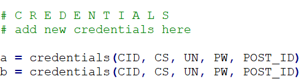

# 1. Create Account
Create a new reddit account at https://ww.reddit.com
Enter some random email (You won't have to confirm it).

And then chose a random username and password. You can just use one of the recommended usernames.

  

You'll also have to confirm that you're not a robot.

# 2. Create app
Then go to https://ssl.reddit.com/prefs/apps/ and click this button to create an app:
  

Select "script". After that fill in the fields with something random. You will also need to enter a url that works. (https://www.google.com/)
  

Then hit "create app"

You can find the client ID and client secret here:
  

# 3. Modify Script
Now open the script
You can enter the post ID to comment here: 
  

You also have to add your client here: 

  
